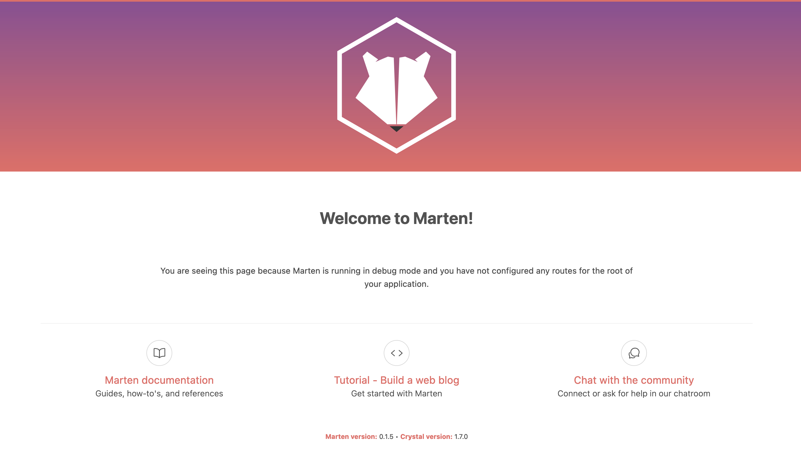

Ce guide vous accompagnera dans la création d'une application de blog simple, qui vous aidera à apprendre les bases du framework web Marten. Il est conçu pour les débutants qui souhaitent démarrer en créant un projet web Marten, aucune expérience préalable avec le framework n'est donc requise.

## Prérequis

Ce guide suppose que [Crystal et le CLI Marten sont déjà correctement installés](./installation.md). Vous pouvez vérifier que le CLI Marten est correctement installé en exécutant la commande suivante :

```bash
marten -v
```

Cela devrait afficher la version de votre installation Marten.

## Qu'est-ce que Marten ?

Marten est un framework d'application web écrit dans le langage de programmation Crystal. Il est conçu pour rendre le développement d'applications web facile et agréable ; et il y parvient en faisant certaines hypothèses concernant les besoins courants que les développeurs peuvent rencontrer lors de la création d'applications web.

## Créer un projet

La création d'un projet est la première chose à faire pour commencer à travailler sur une application web Marten. Ce processus de création peut être effectué via la commande `marten`, et il garantira que la structure de base d'un projet Marten est correctement générée.

Cela peut être fait depuis la ligne de commande, où vous pouvez exécuter la commande suivante pour créer votre premier projet Marten :

```bash
marten new project myblog
```

La commande ci-dessus créera un répertoire `myblog` dans votre répertoire actuel. Ce nouveau dossier devrait avoir le contenu suivant :

```
myblog/
├── config
│   ├── initializers
│   ├── settings
│   │   ├── base.cr
│   │   ├── development.cr
│   │   ├── production.cr
│   │   └── test.cr
│   └── routes.cr
├── spec
│   └── spec_helper.cr
├── src
│   ├── assets
│   ├── emails
│   ├── handlers
│   ├── migrations
│   ├── models
│   ├── schemas
│   ├── templates
│   ├── cli.cr
│   ├── project.cr
│   └── server.cr
├── .editorconfig
├── .gitignore
├── manage.cr
├── seed.cr
└── shard.yml
```

Ces fichiers et dossiers sont décrits ci-dessous :

| Chemin | Description |
| ----------- | ----------- |
| config/ | Contient la configuration du projet. Cela inclut les paramètres de configuration Marten spécifiques à l'environnement, les initialiseurs et les routes de l'application web. |
| spec/ | Contient les specs du projet, vous permettant de tester votre application. | 
| src/ | Contient le code source de l'application. Par défaut, ce dossier inclura un fichier `project.cr` (où toutes les dépendances - y compris Marten lui-même - sont requises), un fichier `server.cr` (qui démarre le serveur web Marten), un fichier `cli.cr` (où les migrations et les abstractions liées au CLI sont requises), ainsi que les dossiers `assets`, `emails`, `handlers`, `migrations`, `models`, `schemas` et `templates`. |
| .editorconfig | Fichier `.editorconfig` standard qui définit les styles d'indentation de base pour Crystal. |
| .gitignore | Fichier `.gitignore` standard qui indique à git les fichiers et répertoires à ignorer. |
| manage.cr | Ce fichier définit un CLI qui vous permet d'interagir avec votre projet Marten pour effectuer diverses actions (par ex. exécuter les migrations de base de données, collecter les assets, etc). |
| seed.cr | Ce fichier peut être utilisé pour définir la logique de peuplement de la base de données de votre projet avec des données initiales ou par défaut. |
| shard.yml | Le fichier standard [shard.yml](https://crystal-lang.org/reference/the_shards_command/index.html), qui liste les dépendances nécessaires à la construction de votre application. |

Maintenant que la structure du projet est créée, vous pouvez vous rendre dans le répertoire `myblog` (si ce n'est pas déjà fait) afin d'installer les dépendances du projet en exécutant la commande suivante :

```bash
shards install
```

:::info
Les projets Marten sont organisés autour du concept d'« apps ». Une app Marten est un ensemble d'abstractions (généralement définies dans un dossier unique) qui apporte des comportements spécifiques à un projet. Par exemple, les apps peuvent fournir des [modèles](../models-and-databases.mdx) ou des [handlers](../handlers-and-http.mdx). Elles permettent de séparer un projet en un ensemble de composants logiques et réutilisables. Un autre avantage intéressant des apps est qu'elles peuvent être extraites et distribuées en tant que shards externes. Ce pattern permet aux bibliothèques tierces de contribuer facilement des modèles, migrations, handlers ou templates à d'autres projets. L'utilisation des apps est activée en ajoutant simplement les classes d'app au paramètre [`installed_apps`](../development/reference/settings.md#installed_apps).

Par défaut, lors de la création d'un nouveau projet via la commande [`new`](../development/reference/management-commands.md#new), aucune app explicite ne sera créée ni installée. Cela s'explique par le fait que chaque projet Marten dispose d'une app « main » par défaut qui correspond à votre dossier `src` standard. Les modèles, migrations ou autres classes définies dans ce dossier sont associés à l'app main par défaut, sauf s'ils font partie d'une autre application explicitement définie.

Au fur et à mesure que les projets grandissent en taille et en portée, il est généralement encouragé de commencer à raisonner en termes d'apps et de réfléchir à la répartition des modèles, handlers ou fonctionnalités entre plusieurs apps en fonction de leurs responsabilités respectives. Veuillez consulter [Applications](../development/applications.md) pour en savoir plus sur les applications et comment structurer vos projets en les utilisant.
:::

## Lancer le serveur de développement

Maintenant que vous disposez d'un projet web entièrement fonctionnel, vous pouvez démarrer un serveur de développement en utilisant la commande suivante :

```bash
marten serve
```

Cela lancera un serveur de développement Marten. Pour vérifier qu'il fonctionne correctement, vous pouvez ouvrir un navigateur et accéder à [http://localhost:8000](http://localhost:8000). Ce faisant, vous devriez être accueilli par la page de « bienvenue » de Marten :



:::info
Votre serveur de développement sera automatiquement disponible sur l'IP interne au port 8000. Le port et l'IP du serveur peuvent être facilement modifiés en éditant le fichier `config/settings/development.cr` :

```crystal
Marten.configure :development do |config|
  config.debug = true
  config.host = "localhost"
  config.port = 3000
end
```
:::

Une fois démarré, le serveur de développement surveillera les fichiers sources de votre projet et les recompilera automatiquement lorsqu'ils seront modifiés ; il prendra également en charge le redémarrage du serveur de votre projet. Ainsi, vous n'avez pas besoin de redémarrer manuellement le serveur lorsque vous apportez des modifications aux fichiers sources de votre application.

## Écrire un premier handler

Commençons par créer le premier handler de votre projet. Pour ce faire, créez un fichier `src/handlers/home_handler.cr` avec le contenu suivant :

```crystal title="src/handlers/home_handler.cr"
class HomeHandler < Marten::Handler
  def get
    respond("Hello World!")
  end
end
```

Les handlers sont des classes qui traitent une requête web afin de produire une réponse web. Cette réponse peut être du contenu HTML rendu ou une redirection par exemple.

Dans l'exemple ci-dessus, le handler `HomeHandler` traite explicitement une requête HTTP `GET` et retourne une réponse `200 OK` très simple contenant un court texte. Mais pour accéder à ce handler via un navigateur, il est nécessaire de l'associer à une route URL. Pour ce faire, vous pouvez éditer le fichier `config/routes.cr` comme suit :

```crystal title="config/routes.cr"
Marten.routes.draw do
  // highlight-next-line
  path "/", HomeHandler, name: "home"
  // highlight-next-line

  if Marten.env.development?
    path "#{Marten.settings.assets.url}<path:path>", Marten::Handlers::Defaults::Development::ServeAsset, name: "asset"
    path "#{Marten.settings.media_files.url}<path:path>", Marten::Handlers::Defaults::Development::ServeMediaFile, name: "media_file"
  end
end
```

Le fichier `config/routes.cr` a été automatiquement créé précédemment lors de l'initialisation de la structure du projet. En utilisant la méthode `#path`, vous avez connecté le `HomeHandler` dans la configuration des routes.

La méthode `#path` accepte trois arguments :

* le premier argument est le pattern de route, qui est une chaîne de caractères comme `/foo/bar`. Lorsque Marten doit résoudre une route, il commence au début du tableau de routes et compare chacune des routes configurées jusqu'à en trouver une correspondante
* le deuxième argument est la classe de handler associée à la route spécifiée. Lorsqu'une URL de requête correspond à une route spécifique, Marten exécute le handler qui lui est associé
* le dernier argument est le nom de la route. C'est un identifiant qui peut être utilisé ultérieurement dans votre code pour générer l'URL complète d'une route spécifique, et éventuellement y injecter des paramètres

Maintenant, si vous accédez à [http://localhost:8000](http://localhost:8000), vous obtiendrez la réponse `Hello World!` générée par le handler que vous venez d'écrire.

:::tip
Plusieurs routes peuvent correspondre à la même classe de handler si nécessaire.
:::

:::info
Veuillez consulter [Routage](../handlers-and-http/routing.md) pour en savoir plus sur le mécanisme de routage de Marten.
:::

## Créer le modèle Article

Les [modèles](../models-and-databases/introduction.md) sont des classes qui définissent quelles données peuvent être persistées et manipulées par une application Marten. Ils spécifient explicitement les champs et les règles qui correspondent aux tables et colonnes de la base de données. Les enregistrements de modèles peuvent être interrogés et manipulés via un mécanisme appelé [Query sets](../models-and-databases/queries.md).

Définissons un modèle `Article`, qui est la pièce maîtresse de toute application de blog. Pour ce faire, créons un fichier `src/models/article.cr` avec le contenu suivant :

```crystal title="src/models/article.cr"
class Article < Marten::Model
  field :id, :big_int, primary_key: true, auto: true
  field :title, :string, max_size: 255
  field :content, :text
end
```

Comme vous pouvez le voir, les modèles Marten sont définis comme des sous-classes de la classe de base `Marten::Model`, et ils définissent explicitement des « champs » via l'utilisation d'une macro `field`.

Dans son état actuel, notre modèle `Article` contient les trois champs suivants :

* `id` est un entier long qui contiendra l'identifiant unique d'un article (clé primaire de l'enregistrement de la table sous-jacente)
* `title` est une colonne de type chaîne (`VARCHAR(255)`) qui contiendra le titre d'un article
* `content` est une colonne de type texte (`TEXT`) qui contiendra le contenu textuel d'un article

## Générer et exécuter les migrations

Notre modèle `Article` ci-dessus est défini mais n'est pas encore « appliqué » au niveau de la base de données. Pour créer la table et les colonnes correspondantes, nous devrons générer une [migration](../models-and-databases/migrations.md) pour celui-ci.

Marten fournit un mécanisme de migrations conçu pour être automatique : cela signifie que les migrations seront automatiquement dérivées de vos définitions de modèles. Cela permet de s'assurer que la définition de votre modèle et de ses champs (et des colonnes sous-jacentes) se fait en un seul endroit, ce qui contribue à garder votre projet DRY.

Pour générer le fichier de migration du modèle que nous avons créé précédemment, il suffit d'exécuter la commande Marten suivante :

```shell
marten genmigrations
```

Cela produira une sortie similaire à ceci :

```shell
Generating migrations for app 'main':
  › Creating [src/migrations/202208072015231_create_main_article_table.cr]... DONE
      ○ Create main_article table
```

La commande `genmigrations` indique à Marten d'introspecter votre projet afin d'identifier si vous avez ajouté, supprimé ou modifié des modèles. Les changements identifiés par cette commande sont persistés dans des fichiers de migration (situés dans les dossiers `migrations/` de chaque application Marten), que vous pouvez exécuter ultérieurement pour les appliquer au niveau de la base de données.

Maintenant que nous avons généré un fichier de migration pour notre modèle `Article`, nous pouvons l'appliquer au niveau de la base de données en exécutant la commande suivante :

```shell
marten migrate
```

Ce qui produira le contenu suivant :

```shell
Running migrations:
  › Applying main_202208072015231_create_main_article_table... DONE
```

La commande `migrate` identifiera tous les fichiers de migration qui n'ont pas encore été appliqués à votre base de données, et les exécutera un par un. Ce faisant, Marten s'assurera que les modifications apportées à vos définitions de modèles sont appliquées au niveau de la base de données, dans les tables correspondantes.

:::info
Veuillez consulter [Migrations](../models-and-databases/migrations.md) pour en savoir plus sur les migrations.
:::

:::note
Pour les nouveaux projets, Marten utilise une base de données SQLite par défaut. Dans notre cas, si nous examinons le fichier `config/settings/base.cr`, nous pouvons voir que la configuration actuelle de la base de données ressemble à ceci :

```crystal
config.database do |db|
  db.backend = :sqlite
  db.name = Path["myblog.db"].expand
end
```

Une base de données SQLite est un bon choix pour essayer Marten et expérimenter avec (puisque SQLite est déjà pré-installé sur la plupart des systèmes). Cela dit, si vous avez besoin d'utiliser un autre backend de base de données (par exemple, PostgreSQL, MariaDB ou MySQL), n'hésitez pas à consulter la [référence de configuration des bases de données](../development/reference/settings.md#database-settings).
:::

## Interagir avec les enregistrements de modèles

Maintenant que la table de notre modèle `Article` a été créée au niveau de la base de données, essayons d'utiliser l'ORM de Marten pour créer et interroger des enregistrements d'articles.

Pour ce faire, nous pouvons lancer une instance du [Crystal playground](https://crystal-lang.org/reference/master/using_the_compiler/index.html#crystal-play) comme suit :

```shell
marten play
```

Vous devriez pouvoir accéder à [http://localhost:8080](http://localhost:8080) et voir un éditeur Crystal contenant le snippet suivant :

```crystal
require "./src/project"

# Setup the project.
Marten.setup

# Write your code here.
```

Ces lignes requièrent essentiellement les dépendances de votre projet et s'assurent que Marten est correctement configuré. Vous devriez les conserver dans l'éditeur lorsque vous expérimentez avec les exemples suivants. Chacun des snippets suivants est supposé être copié/collé à la suite du précédent. La sortie de ces exemples est indiquée à côté du commentaire `# =>`.

Commençons par initialiser un nouvel objet `Article` :

```crystal
article = Article.new(title: "My article", content: "This is my article.")
# => #<Article:0x102c4dbe0 id: nil, title: "My article", content: "This is my article.">
```

Comme vous pouvez le voir, en utilisant `#new`, nous initialisons un nouvel objet `Article` en spécifiant les valeurs de ses champs (`title` et `content`). Il convient de noter que pour l'instant, l'objet est uniquement _initialisé_ et n'est pas encore enregistré dans la base de données (c'est pourquoi `id` est à `nil` dans le snippet ci-dessus). Pour persister le nouvel objet au niveau de la base de données, vous pouvez utiliser la méthode `#save` :

```crystal
article.save
# => true
```

La sortie de la méthode `#save` est un booléen indiquant le résultat de la validation de l'objet : dans notre cas, `true` signifie que l'objet `Article` a été validé avec succès et que l'enregistrement correspondant a été créé au niveau de la base de données.

Maintenant, si nous inspectons à nouveau l'objet `article`, nous devrions observer qu'un `id` a été attribué à l'enregistrement en question :

```crystal
article
# => #<Article:0x104ee1c30 id: 1, title: "My article", content: "This is my article.">
```

Si nous voulons récupérer cet enregistrement depuis la base de données à nouveau, nous pouvons utiliser la méthode [`#get`](../models-and-databases/reference/query-set.md#get) et spécifier la valeur de l'identifiant de l'enregistrement que nous voulons récupérer. Par exemple :

```crystal
article = Article.get(id: 1)
# => #<Article:0x104c699b0 id: 1, title: "My article", content: "This is my article.">
```

Nous pouvons maintenant essayer de récupérer tous les enregistrements `Article` que nous avons actuellement dans la base de données. Cela se fait en appelant la méthode `#all` sur le modèle `Article` :

```crystal
Article.all
# => <Article::QuerySet [#<Article:0x1039296e0 id: 1, title: "My article", content: "This is my article.">]>
```

Cette méthode retourne un objet `Article::QuerySet`, communément appelé « query set ». Un query set est une représentation de collections d'enregistrements de la base de données qui peut être filtrée et itérée. La classe `Article::QuerySet`, automatiquement générée pour le modèle `Article`, est une sous-classe de `Marten::DB::Query::Set`.

:::info
Veuillez consulter [Requêtes](../models-and-databases/queries.md) pour en savoir plus sur les capacités de requêtage de Marten.
:::

## Afficher une liste d'articles

Reprenons notre implémentation initiale du handler `HomeHandler` que nous avons défini [précédemment](#écrire-un-premier-handler).

Puisque nous construisons une application de blog, il serait logique d'afficher la liste de tous nos objets `Article` sur la page d'accueil. Pour ce faire, mettons à jour le fichier existant `src/handlers/home_handler.cr` avec le contenu suivant :

```crystal title="src/handlers/home_handler.cr"
class HomeHandler < Marten::Handler
  def get
    render("home.html", context: { articles: Article.all })
  end
end
```

La méthode `#render` utilisée ci-dessus permet de retourner une réponse HTTP dont le contenu est généré en rendant un [template](../templates.mdx) spécifique. Le template peut être rendu en spécifiant un hash de contexte ou un named tuple. Dans notre cas, le contexte du template contient une clé `articles` qui correspond à un query set de tous les enregistrements `Article`.

Maintenant, si vous relancez le serveur de développement Marten puis essayez d'accéder à la page d'accueil ([http://localhost:8000](http://localhost:8000)), vous devriez obtenir une erreur indiquant que le template `home.html` n'existe pas. C'est normal : nous devons le créer.

Les templates offrent un moyen pratique de définir la logique de présentation d'une application web. Ils permettent d'écrire du contenu HTML qui est rendu dynamiquement en utilisant des variables que vous spécifiez dans un « contexte de template ». Ce processus de rendu peut impliquer des enregistrements de modèles ou toute autre variable que vous définissez.

Définissons le template attendu pour notre handler home en créant un fichier `src/templates/home.html` avec le contenu suivant :

```html title="src/templates/home.html"



  <h1>My blog</h1>
  <h2>Articles:</h2>
  <ul>
  
    <li>{{ article.title }}</li>
  
  </ul>

```

Comme vous pouvez le voir, le système de templates de Marten repose sur des variables entourées de **`{{`** et **`}}`**. Chaque variable peut impliquer des lookups pour accéder à des attributs spécifiques d'un objet. Dans l'exemple ci-dessus, `{{ article.title }}` signifie que l'attribut `title` de la variable `article` doit être affiché.

L'appel de méthodes se fait en utilisant des instructions (également appelées « tags de template ») délimitées par **``**. Ces instructions peuvent impliquer des boucles for, des conditions if, etc. Dans l'exemple ci-dessus, nous utilisons une boucle for pour itérer sur les enregistrements `Article` du query set `articles` qui est « passé » au contexte du template dans notre handler `HomeHandler`.

:::info
Veuillez consulter [Templates](../templates/introduction.md) pour en savoir plus sur le système de templates de Marten.
:::

:::info
Que signifient les tags `extend` et `block` dans le snippet précédent ? Ces tags permettent d'« étendre » un template « de base » qui contient généralement la mise en page d'une application (`base.html` dans le snippet ci-dessus) et de définir explicitement le contenu des « blocs » attendus par ce template de base. Les nouveaux projets Marten sont créés avec un simple template `base.html` qui définit un document HTML très basique, dont le corps est rempli avec le contenu d'un bloc `content`. C'est pourquoi les templates de ce tutoriel étendent un `base.html` et redéfinissent le contenu du bloc `content`.

Vous pouvez en savoir plus sur ces capacités dans [Héritage de templates](../templates/introduction.md#template-inheritance).
:::

Si vous retournez sur la page d'accueil ([http://localhost:8000](http://localhost:8000)), vous devriez pouvoir voir une liste de titres d'articles correspondant à tous les enregistrements `Article` que vous avez créés précédemment.

Nous avons maintenant assemblé les composants principaux du framework web Marten (Modèles, Handlers, Templates). Lors de l'accès à la page d'accueil de notre application, les étapes suivantes sont prises en charge par le framework :

1. le navigateur émet une requête GET vers `http://localhost:8000`
2. l'application web Marten qui est en cours d'exécution reçoit la requête
3. le système de routage de Marten associe le chemin de la requête entrante au handler `HomeHandler`
4. le handler est initialisé et exécuté, ce qui implique la récupération de tous les enregistrements `Article`
5. le handler rend le template `home.html` et retourne une réponse `200 OK` contenant le contenu rendu
6. le serveur Marten renvoie la réponse avec le contenu HTML au navigateur

## Afficher un seul article

Nous avons actuellement un handler qui liste tous les enregistrements `Article` existants, mais il serait agréable de pouvoir voir le contenu de chaque article individuellement.

Pour ce faire, créons un nouveau fichier handler `src/handlers/article_detail_handler.cr` avec le contenu suivant :

```crystal title="src/handlers/article_detail_handler.cr"
class ArticleDetailHandler < Marten::Handler
  def get
    render("article_detail.html", context: { article: Article.get!(id: params["pk"]) })
  rescue Marten::DB::Errors::RecordNotFound
    raise Marten::HTTP::Errors::NotFound.new("Article not found")
  end
end
```

Comme dans l'exemple précédent, nous nous appuierons sur la méthode `#render` pour rendre un template et retourner la réponse HTTP correspondante. Mais cette fois, nous récupérerons un enregistrement spécifique dont le paramètre sera spécifié dans un paramètre de route `pk`.

:::note
Vous remarquerez que nous utilisons la méthode `#get!` pour récupérer l'enregistrement du modèle dans l'exemple ci-dessus. Cette méthode se comporte de manière similaire à la méthode `#get` que nous avons vue précédemment, mais elle lèvera une exception « enregistrement non trouvé » si aucun enregistrement ne peut être trouvé pour les paramètres spécifiés. Dans ce cas, nous pouvons « rescuer » cette erreur afin de lever une exception HTTP « Not Found » qui entraînera le retour d'une réponse 404.
:::

Associons maintenant ce handler à une nouvelle route en ajoutant la ligne suivante au fichier `config/routes.cr` :

```crystal title="config/routes.cr"
Marten.routes.draw do
  path "/", HomeHandler, name: "home"
  // highlight-next-line
  path "/article/<pk:int>", ArticleDetailHandler, name: "article_detail"

  if Marten.env.development?
    path "#{Marten.settings.assets.url}<path:path>", Marten::Handlers::Defaults::Development::ServeAsset, name: "asset"
    path "#{Marten.settings.media_files.url}<path:path>", Marten::Handlers::Defaults::Development::ServeMediaFile, name: "media_file"
  end
end
```

Comme vous pouvez le voir ci-dessus, la nouvelle route que nous avons associée au handler `ArticleDetailHandler` nécessite un paramètre entier (`int`) `pk` - _clé primaire_. Les paramètres de route sont définis à l'aide de chevrons, et le nom du paramètre et son type sont séparés par un caractère `:` (format `<nom:type>`).

Évidemment, nous devons également définir le template `article_detail.html`. Pour ce faire, créons un fichier `src/templates/article_detail.html` avec le contenu suivant :

```html title="src/templates/article_detail.html"



  <h1>{{ article.title }}</h1>
  <p>{{ article.content }}</p>

```

Maintenant, si vous essayez d'accéder à [http://localhost:8000/article/1](http://localhost:8000/article/1), vous pourrez voir le contenu de l'enregistrement `Article` avec l'ID 1.

Il manque cependant quelque chose : la page d'accueil ne contient pas de lien vers la page de « détail » de chaque article. Pour remédier à cela, nous pouvons modifier le fichier template `src/templates/home.html` comme suit :

```html title="src/templates/home.html"



  <h1>My blog</h1>
  <h2>Articles:</h2>
  <ul>
  
  // highlight-next-line
    <li>
  // highlight-next-line
      {{ article.title }}
  // highlight-next-line
      &dash; <a href="">View</a>
  // highlight-next-line
    </li>
  
  </ul>

```

Le tag `url` utilisé dans le snippet ci-dessus permet d'effectuer une résolution inverse d'URL. Cela permet de générer l'URL finale associée à un nom de route spécifique (le nom de route `article_detail` que nous avons défini précédemment dans ce cas). Cette résolution inverse peut impliquer des paramètres si la route concernée en requiert.

:::info
Veuillez consulter [Routage](../handlers-and-http/routing.md) pour en savoir plus sur le système de routage de Marten.
:::

## Créer un nouvel article

Jusqu'à présent, nous n'avons implémenté que des opérations de « lecture » : nous avons rendu possible l'affichage de la liste de tous les articles disponibles sur la page d'accueil, et nous avons ajouté la possibilité de voir le contenu d'un article spécifique sur la page de « détail ». L'étape suivante sera de permettre la création de nouveaux articles pour alimenter notre blog.

Pour ce faire, commençons par créer un nouveau fichier schema `src/schemas/article_schema.cr` avec le contenu suivant :

```crystal title="src/schemas/article_schema.cr"
class ArticleSchema < Marten::Schema
  field :title, :string, max_size: 255
  field :content, :string
end
```

Nous venons de définir un « schema ». Les schemas sont des classes qui définissent comment les données d'entrée doivent être sérialisées / désérialisées et validées. Les schemas sont généralement utilisés lors du traitement de requêtes web contenant des données de formulaire ou des charges utiles prédéfinies. Comme les modèles, ils contiennent un ensemble de champs prédéfinis qui indiquent quels paramètres sont attendus, quels sont leurs types et comment ils doivent être validés.

Voyons comment nous pouvons utiliser ce schema dans un handler. Dans cette optique, créons un nouveau fichier `src/handlers/article_create_handler.cr` :

```crystal title="src/handlers/article_create_handler.cr"
class ArticleCreateHandler < Marten::Handler
  @schema : ArticleSchema?

  def get
    render("article_create.html", context: { schema: schema })
  end

  def post
    if schema.valid?
      article = Article.new(schema.validated_data)
      article.save!

      redirect(reverse("home"))
    else
      render("article_create.html", context: { schema: schema }, status: 422)
    end
  end

  private def schema
    @schema ||= ArticleSchema.new(request.data)
  end
end
```

Ce handler est capable de traiter à la fois les requêtes GET et POST :

* lorsque la requête entrante est un GET, il rendra simplement le template `article_create.html`, et initialisera le schema (instance de `ArticleSchema`) avec les données actuellement présentes dans l'objet de requête (qui est retourné par la méthode `#request`). Cet objet schema est mis à disposition dans le contexte du template
* lorsque la requête entrante est un POST, il initialisera le schema et tentera de voir s'il est valide compte tenu des données entrantes. S'il est valide, alors le nouvel enregistrement `Article` sera créé en utilisant les données validées du schema, et l'utilisateur sera redirigé vers la page d'accueil. Sinon, le template `article_create.html` sera rendu à nouveau avec le schema invalide dans le contexte associé

Dans le snippet ci-dessus, nous utilisons `#redirect` pour indiquer que nous voulons retourner une réponse HTTP 302 Found, et nous générons l'URL de redirection en effectuant une résolution inverse de la route `home` que nous avons introduite précédemment en utilisant la méthode `#reverse` (qui est similaire au tag de template `url` que nous avons rencontré dans la section précédente).

Nous pouvons maintenant créer le fichier template `article_create.html` avec le contenu suivant :

```html title="src/templates/article_create.html"



  <h1>Create a new article</h1>
  <form method="post" action="" novalidate>
    <input type="hidden" name="csrftoken" value="" />

    <div><label>Title</label></div>
    <input type="text" name="{{ schema.title.id }}" value="{{ schema.title.value }}"/>
    <p class="input-error"><small>{{ error.message }}</small></p>

    <div><label>Content</label></div>
    <textarea name="{{ schema.content.id }}" value="{{ schema.content.value }}">{{ schema.content.value }}</textarea>
    <p class="input-error"><small>{{ error.message }}</small></p>

    <div><button>Submit</button></div>
  </form>

```

Comme vous pouvez le voir, le snippet ci-dessus définit un formulaire qui inclut deux champs : un pour le champ de schema `title` et l'autre pour le champ de schema `content`. Chaque champ de schema peut être en erreur selon le résultat d'une validation, et c'est pourquoi les erreurs spécifiques aux champs sont (optionnellement) affichées également.

:::tip Qu'en est-il de l'input caché du jeton CSRF ?
L'input `csrftoken` dans l'exemple ci-dessus est obligatoire car chaque requête non sécurisée (par ex. POST) est automatiquement protégée par une vérification CSRF (Cross-Site Request Forgeries). Veuillez consulter [Protection contre les falsifications de requêtes inter-sites](../security/csrf.md) pour en savoir plus à ce sujet.
:::

Enfin, nous devons associer le handler `ArticleCreateHandler` à une route appropriée. Nous pouvons le faire en éditant le fichier `config/routes.cr` comme suit :

```crystal title="config/routes.cr"
Marten.routes.draw do
  path "/", HomeHandler, name: "home"
  // highlight-next-line
  path "/article/create", ArticleCreateHandler, name: "article_create"
  path "/article/<pk:int>", ArticleDetailHandler, name: "article_detail"

  if Marten.env.development?
    path "#{Marten.settings.assets.url}<path:path>", Marten::Handlers::Defaults::Development::ServeAsset, name: "asset"
    path "#{Marten.settings.media_files.url}<path:path>", Marten::Handlers::Defaults::Development::ServeMediaFile, name: "media_file"
  end
end
```

Maintenant, si vous ouvrez votre navigateur à [http://localhost:8000/article/create](http://localhost:8000/article/create), vous devriez pouvoir voir un formulaire très basique permettant de créer un nouvel enregistrement `Article` et d'être redirigé vers celui-ci.

Évidemment, nous avons encore besoin d'un lien quelque part dans notre application pour pouvoir accéder facilement au formulaire de création d'article. Dans cette optique, nous pouvons modifier le fichier template `home.html` comme suit :

```html title="src/templates/home.html"



  <h1>My blog</h1>
  // highlight-next-line
  <a href="">Create new article</a>
  <h2>Articles:</h2>
  <ul>
  
    <li>
      {{ article.title }}
      &dash; <a href="">View</a>
    </li>
  
  </ul>

```

:::info
Veuillez consulter [Schemas](../schemas/introduction.md) pour en savoir plus sur les schemas.
:::

## Mettre à jour un article

Maintenant que nous sommes en mesure de créer de nouveaux enregistrements `Article`, ajoutons la possibilité de mettre à jour les enregistrements existants. Pour ce faire, nous allons implémenter un handler qui fonctionne de manière similaire au handler `ArticleCreateHandler` que nous avons défini précédemment : il devrait être capable de traiter les requêtes GET pour afficher un formulaire de « mise à jour », et il devrait valider les données entrantes (et mettre à jour le bon enregistrement) lorsque des requêtes POST sont soumises via un formulaire HTML.

Dans cette optique, définissons le fichier `src/handlers/article_update_handler.cr` avec le contenu suivant :

```crystal title="src/handlers/article_update_handler.cr"
class ArticleUpdateHandler < Marten::Handler
  @article : Article?
  @schema : ArticleSchema?

  def get
    render("article_update.html", context: { article: article, schema: schema })
  end

  def post
    if schema.valid?
      article.update!(schema.validated_data)
      redirect(reverse("home"))
    else
      render("article_update.html", context: { article: article, schema: schema }, status: 422)
    end
  end

  private def article
    @article ||= Article.get!(id: params["pk"])
  rescue Marten::DB::Errors::RecordNotFound
    raise Marten::HTTP::Errors::NotFound.new("Article not found")
  end

  private def initial_schema_data
    Marten::Schema::DataHash{ "title" => article.title, "content" => article.content }
  end

  private def schema
    @schema ||= ArticleSchema.new(request.data, initial: initial_schema_data)
  end
end
```

Ici, les implémentations des méthodes `#get` et `#post` ressemblent à ce qui a été introduit pour le handler `ArticleCreateHandler`. La principale différence est qu'un enregistrement `Article` spécifique doit être récupéré. De plus, le schema `ArticleSchema` est initialisé avec des « données initiales » (objet de type hash `Marten::Schema::DataHash`) qui correspondent aux valeurs actuelles des champs `title` et `content` de l'enregistrement considéré. Lorsqu'un schema valide est traité, au lieu de créer un nouvel enregistrement, nous mettons simplement à jour celui considéré via l'utilisation de la méthode `#update!`.

Nous pouvons maintenant créer le fichier template `article_update.html` avec le contenu suivant :

```html title="src/templates/article_update.html"



  <h1>Update article "{{ article.title }}"</h1>
  <form method="post" action="" novalidate>
    <input type="hidden" name="csrftoken" value="" />

    <div><label>Title</label></div>
    <input type="text" name="{{ schema.title.id }}" value="{{ schema.title.value }}"/>
    <p class="input-error"><small>{{ error.message }}</small></p>

    <div><label>Content</label></div>
    <textarea name="{{ schema.content.id }}" value="{{ schema.content.value }}">{{ schema.content.value }}</textarea>
    <p class="input-error"><small>{{ error.message }}</small></p>

    <div><button>Submit</button></div>
  </form>

```

Comme vous pouvez le voir, cela ressemble beaucoup à ce que nous avons fait précédemment avec le fichier template `article_create.html`.

Associons maintenant le handler `ArticleUpdateHandler` à une route appropriée. Nous pouvons le faire en éditant le fichier `config/routes.cr` comme suit :

```crystal title="config/routes.cr"
Marten.routes.draw do
  path "/", HomeHandler, name: "home"
  path "/article/create", ArticleCreateHandler, name: "article_create"
  path "/article/<pk:int>", ArticleDetailHandler, name: "article_detail"
  // highlight-next-line
  path "/article/<pk:int>/update", ArticleUpdateHandler, name: "article_update"

  if Marten.env.development?
    path "#{Marten.settings.assets.url}<path:path>", Marten::Handlers::Defaults::Development::ServeAsset, name: "asset"
    path "#{Marten.settings.media_files.url}<path:path>", Marten::Handlers::Defaults::Development::ServeMediaFile, name: "media_file"
  end
end
```

Maintenant, si vous ouvrez votre navigateur à [http://localhost:8000/article/1/update](http://localhost:8000/article/1/update), vous devriez pouvoir voir un formulaire très basique permettant de mettre à jour l'enregistrement `Article` avec l'ID 1.

Nous pouvons également ajouter un lien quelque part dans la page d'accueil de l'application pour pouvoir accéder facilement au formulaire de mise à jour des articles existants. Dans cette optique, nous pouvons modifier le fichier template `home.html` comme suit :

```html title="src/templates/home.html"



  <h1>My blog</h1>
  <a href="">Create new article</a>
  <h2>Articles:</h2>
  <ul>
  
    <li>
      {{ article.title }}
      &dash; <a href="">View</a>
      // highlight-next-line
      &dash; <a href="">Update</a>
    </li>
  
  </ul>

```

## Supprimer un article

Enfin, la dernière fonctionnalité manquante que nous pourrions ajouter est la possibilité de supprimer un article. Pour ce faire, introduisons un handler qui fonctionne comme suit : lors du traitement d'une requête GET, le handler demandera à l'utilisateur de confirmer qu'il souhaite effectivement supprimer l'enregistrement `Article` considéré, et lors du traitement d'une requête POST, le handler supprimera réellement l'enregistrement puis redirigera vers la page d'accueil de l'application.

Dans cette optique, définissons le fichier `src/handlers/article_delete_handler.cr` :

```crystal title="src/handlers/article_delete_handler.cr"
class ArticleDeleteHandler < Marten::Handler
  @article : Article?

  def get
    render("article_delete.html", context: { article: article })
  end

  def post
    article.delete
    redirect(reverse("home"))
  end

  private def article
    @article ||= Article.get!(id: params["pk"])
  rescue Marten::DB::Errors::RecordNotFound
    raise Marten::HTTP::Errors::NotFound.new("Article not found")
  end
end
```

Dans le snippet ci-dessus, la méthode `#get` récupère simplement l'enregistrement `Article` en utilisant la valeur du paramètre `pk` et rend le template `article_delete.html` (avec l'article dans le contexte associé). La méthode `#post` récupère également l'enregistrement `Article` et le supprime avant de rediriger l'utilisateur vers la page d'accueil.

Créons maintenant le fichier template `article_delete.html` avec le contenu suivant :

```html title="src/templates/article_delete.html"



  <h1>Delete article "{{ article.title }}"</h1>
  <p>Are you sure?</p>
  <form method="post" action="">
    <input type="hidden" name="csrftoken" value="" />
    <button>Yes, delete</button>
  </form>

```

Ce template demande simplement une confirmation à l'utilisateur et affiche un bouton de confirmation intégré dans un formulaire pour émettre la requête POST qui supprimera réellement l'enregistrement.

Associons maintenant le handler `ArticleDeleteHandler` à une route appropriée. Nous pouvons le faire en éditant le fichier `config/routes.cr` comme suit :

```crystal title="config/routes.cr"
Marten.routes.draw do
  path "/", HomeHandler, name: "home"
  path "/article/create", ArticleCreateHandler, name: "article_create"
  path "/article/<pk:int>", ArticleDetailHandler, name: "article_detail"
  path "/article/<pk:int>/update", ArticleUpdateHandler, name: "article_update"
  // highlight-next-line
  path "/article/<pk:int>/delete", ArticleDeleteHandler, name: "article_delete"

  if Marten.env.development?
    path "#{Marten.settings.assets.url}<path:path>", Marten::Handlers::Defaults::Development::ServeAsset, name: "asset"
    path "#{Marten.settings.media_files.url}<path:path>", Marten::Handlers::Defaults::Development::ServeMediaFile, name: "media_file"
  end
end
```

Maintenant, si vous ouvrez votre navigateur à [http://localhost:8000/article/1/delete](http://localhost:8000/article/1/delete), vous devriez pouvoir voir la page de confirmation permettant de supprimer l'enregistrement `Article` avec l'ID 1.

Nous pouvons également ajouter un lien quelque part dans la page d'accueil de l'application pour pouvoir accéder facilement à la page de confirmation de suppression des articles existants. Dans cette optique, nous pouvons modifier le fichier template `home.html` comme suit :

```html title="src/templates/home.html"



  <h1>My blog</h1>
  <a href="">Create new article</a>
  <h2>Articles:</h2>
  <ul>
  
    <li>
      {{ article.title }}
      &dash; <a href="">View</a>
      &dash; <a href="">Update</a>
      // highlight-next-line
      &dash; <a href="">Delete</a>
    </li>
  
  </ul>

```

## Refactorisation : utiliser des partials de templates

Les templates utilisés pour la création et la mise à jour d'un article se ressemblent : ils utilisent tous deux le même schema pour créer ou mettre à jour des articles. Il serait intéressant de pouvoir réutiliser ce formulaire pour les deux templates. C'est là que les « partials » de templates sont utiles : ce sont des fragments de templates qui peuvent être facilement « inclus » dans d'autres templates pour éviter les duplications de code.

Créons un partial `src/templates/partials/article_form.html` avec le contenu suivant :

```html title="src/templates/partials/article_form.html"
<form method="post" action="" novalidate>
  <input type="hidden" name="csrftoken" value="" />

  <div><label>Title</label></div>
  <input type="text" name="{{ schema.title.id }}" value="{{ schema.title.value }}"/>
  <p class="input-error"><small>{{ error.message }}</small></p>

  <div><label>Content</label></div>
  <textarea name="{{ schema.content.id }}" value="{{ schema.content.value }}">{{ schema.content.value }}</textarea>
  <p class="input-error"><small>{{ error.message }}</small></p>

  <div><button>Submit</button></div>
</form>
```

Ce partial de template contient exactement le même formulaire que celui utilisé dans les templates de création et de mise à jour.

Utilisons maintenant ce partial dans les templates `src/templates/article_create.html` et `src/templates/article_update.html` en exploitant le tag de template [`include`](../templates/reference/tags.md#include) :

```html title="src/templates/article_create.html"



  <h1>Create a new article</h1>
  

```

```html title="src/templates/article_update.html"



  <h1>Update article "{{ article.title }}"</h1>
  

```

Comme vous pouvez le voir, les templates de création et de mise à jour sont maintenant beaucoup plus simples.

:::tip
Le tag de template `include` offre des options supplémentaires comme la possibilité d'assigner des variables spécifiques au template inclus. Veuillez consulter la [référence du tag de template `include`](../templates/reference/tags.md#include) pour en savoir plus sur ce mécanisme.
:::

## Refactorisation : utiliser des handlers génériques

Les handlers que nous avons implémentés précédemment correspondent à des cas d'utilisation courants du développement web : récupérer des données de la base de données - à partir d'un paramètre URL spécifique - et les afficher, lister plusieurs objets, créer ou mettre à jour des enregistrements, etc. Ces cas d'utilisation sont si fréquemment rencontrés que Marten fournit un ensemble de « handlers génériques » qui permettent de les implémenter facilement. Ces handlers génériques prennent en charge ces patterns courants afin que les développeurs n'aient pas à réinventer la roue.

Nous pourrions certainement exploiter ces handlers génériques dans notre application de blog.

Dans cette optique, commençons par la classe `HomeHandler` que nous avons implémentée précédemment : ce handler récupère essentiellement tous les enregistrements `Article` et rend cette liste disponible dans le template `home.html`. Ce pattern est rendu possible par le handler générique [`Marten::Handlers::RecordList`](pathname:///api/dev/Marten/Handlers/RecordList.html). Pour l'utiliser, modifions le fichier `src/handlers/home_handler.cr` comme suit :

```crystal title="src/handlers/home_handler.cr"
class HomeHandler < Marten::Handlers::RecordList
  model Article
  template_name "home.html"
  list_context_name "articles"
end
```

Dans le snippet ci-dessus, nous utilisons quelques méthodes de classe pour définir comment le handler doit se comporter : `#model` permet de définir la classe de modèle qui doit être utilisée pour récupérer les enregistrements, `#template_name` permet de définir le nom du template à rendre, et `#list_context_name` permet de définir le nom de la variable de la liste d'enregistrements dans le contexte du template.

Continuons avec la classe `ArticleDetailHandler` : ce handler récupère un enregistrement `Article` spécifique à partir d'un paramètre de route `pk`, et le « rend » en utilisant un template spécifique. Ce pattern est rendu possible par le handler générique [`Marten::Handlers::RecordDetail`](pathname:///api/dev/Marten/Handlers/RecordDetail.html). Pour l'utiliser, modifions le fichier `src/handlers/article_detail_handler.cr` comme suit :

```crystal title="src/handlers/article_detail_handler.cr"
class ArticleDetailHandler < Marten::Handlers::RecordDetail
  model Article
  template_name "article_detail.html"
  record_context_name "article"
end
```

Pour configurer le comportement du handler, nous utilisons ici aussi quelques méthodes de classe : `#model` permet de définir la classe de modèle de l'enregistrement à récupérer, `#template_name` définit le template à rendre, et `#record_context_name` définit le nom de la variable de l'enregistrement dans le contexte du template.

Examinons maintenant la classe `ArticleCreateHandler` : cette classe affiche un formulaire lors du traitement des requêtes GET, et valide un schema utilisé pour créer un enregistrement spécifique lors du traitement des requêtes POST. Ce pattern exact est rendu possible par le handler générique [`Marten::Handlers::RecordCreate`](pathname:///api/dev/Marten/Handlers/RecordCreate.html). Pour l'utiliser, nous pouvons modifier le fichier `src/handlers/article_create_handler.cr` comme suit :

```crystal title="src/handlers/article_create_handler.cr"
class ArticleCreateHandler < Marten::Handlers::RecordCreate
  model Article
  schema ArticleSchema
  template_name "article_create.html"
  success_route_name "home"
end
```

Ici, `#model` permet de définir la classe de modèle à utiliser pour créer le nouvel enregistrement, `#schema` est la classe de schema qui doit être utilisée pour valider les données entrantes, `#template_name` définit le nom du template à rendre, et `#success_route_name` est le nom de la route vers laquelle rediriger après une création d'enregistrement réussie.

Nous pouvons maintenant examiner la classe `ArticleUpdateHandler` : cette classe récupère un enregistrement spécifique et affiche un formulaire lors du traitement des requêtes GET, et valide un schema dont les données sont utilisées pour mettre à jour l'enregistrement lors du traitement des requêtes POST. Ce pattern est rendu possible par le handler générique [`Marten::Handlers::RecordUpdate`](pathname:///api/dev/Marten/Handlers/RecordUpdate.html). Utilisons-le et modifions le fichier `src/handlers/article_update_handler.cr` comme suit :

```crystal title="src/handlers/article_update_handler.cr"
class ArticleUpdateHandler < Marten::Handlers::RecordUpdate
  model Article
  schema ArticleSchema
  template_name "article_update.html"
  success_route_name "home"
  record_context_name "article"
end
```

Ici, `#model` permet de définir la classe de modèle à utiliser pour récupérer et mettre à jour l'enregistrement, `#schema` est la classe de schema qui doit être utilisée pour valider les données entrantes, `#template_name` définit le nom du template à rendre, `#success_route_name` est le nom de la route vers laquelle rediriger après une mise à jour réussie, et `#record_context_name` est le nom de la variable de l'enregistrement dans le contexte du template.

Enfin, examinons la classe `ArticleDeleteHandler` : ce handler rend un template lors du traitement des requêtes GET, et effectue la suppression de l'enregistrement considéré lors du traitement des requêtes POST. Ce pattern est fourni par le handler générique [`Marten::Handlers::RecordDelete`](pathname:///api/dev/Marten/Handlers/RecordDelete.html). Pour l'utiliser, modifions le fichier `src/handlers/article_delete_handler.cr` comme suit :

```crystal title="src/handlers/article_delete_handler.cr"
class ArticleDeleteHandler < Marten::Handlers::RecordDelete
  model Article
  template_name "article_delete.html"
  success_route_name "home"
  record_context_name "article"
end
```

Pour configurer le comportement du handler, nous utilisons ici aussi quelques méthodes de classe : `#model` permet de définir la classe de modèle de l'enregistrement à récupérer et supprimer, `#template_name` définit le template à rendre, et `#success_route_name` définit le nom de la route vers laquelle rediriger une fois l'enregistrement supprimé.

Maintenant, si vous retournez sur votre application à [http://localhost:8000](http://localhost:8000), vous constaterez que tout fonctionne comme avant l'introduction de ces modifications (mais avec moins de code !).

:::info
Veuillez consulter [Handlers génériques](../handlers-and-http/generic-handlers.md) pour en savoir plus sur les handlers génériques.
:::

## Et ensuite ?

Dans le cadre de ce tutoriel, nous avons couvert les principales fonctionnalités du framework web Marten en implémentant une application très simple :

* nous avons appris à définir des [modèles](../models-and-databases.mdx) pour interagir avec la base de données
* nous avons appris à créer des [handlers](../handlers-and-http.mdx) et à associer des URL à ceux-ci pour traiter les requêtes HTTP
* nous avons appris à rendre des [templates](../templates.mdx) pour définir la logique de présentation d'une application

Maintenant que vous avez expérimenté avec ces concepts fondamentaux du framework, n'hésitez pas à mettre à jour l'application que nous venons de créer pour expérimenter davantage et y ajouter de nouvelles fonctionnalités.

La documentation de Marten contient également de nombreux guides supplémentaires vous permettant de continuer à explorer et à en apprendre davantage sur d'autres aspects du framework. Ceux-ci peuvent être utiles en fonction des besoins spécifiques de votre application : [Tests](../development/testing.md), [Applications](../development/applications.md), [Sécurité](../security.mdx), [Internationalisation](../i18n.mdx), etc.
